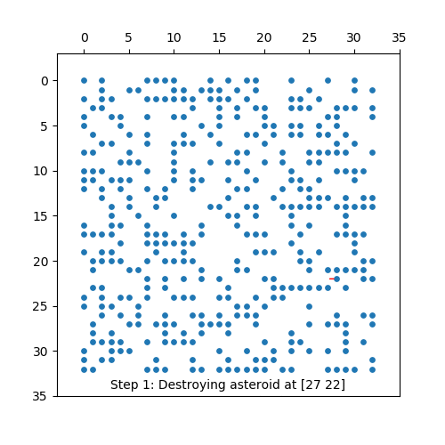
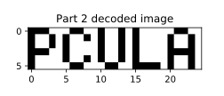
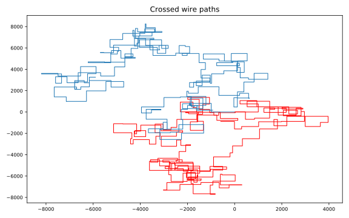

My solutions to the [Advent of Code](https://adventofcode.com/) challenge. 

## 2019 Highlights
### [Day 12](https://adventofcode.com/2019/day/12)
3D animation of 4 Jupiter moons, made with Blender, using the coordinates from the "N-Body problem" of day 12.

### [Day 10](https://adventofcode.com/2019/day/10)
Destroying asteroids with a laser beam. 

 

### [Day 8](https://adventofcode.com/2019/day/8)

 

### [Day 3](https://adventofcode.com/2019/day/3)
